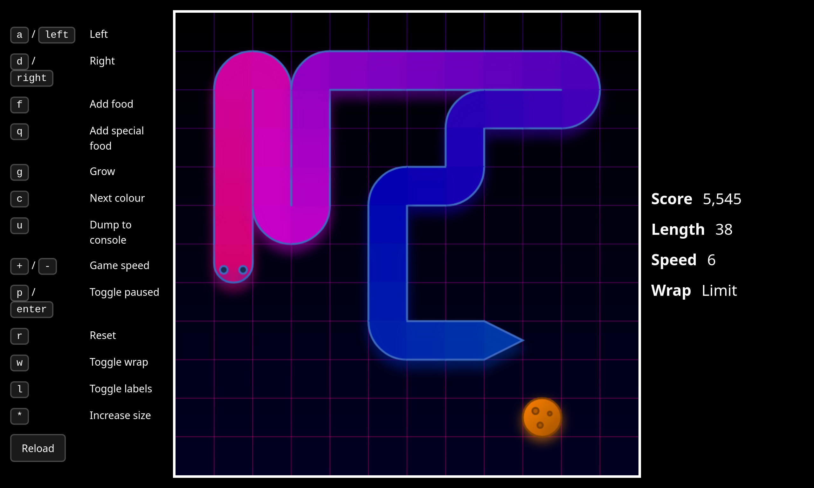

## Snek

Written in TypeScript, React, Tailwind, and canvas2d

### Running in the browser

- [GitHub Pages deployment](https://idkidk000.github.io/snek/)

### Running the dev server locally

- Clone the repo

- Install dependencies with `npm install`, `deno install`, etc

- Run the `dev` script to start the dev server with `npm run dev`, `deno task dev`, etc